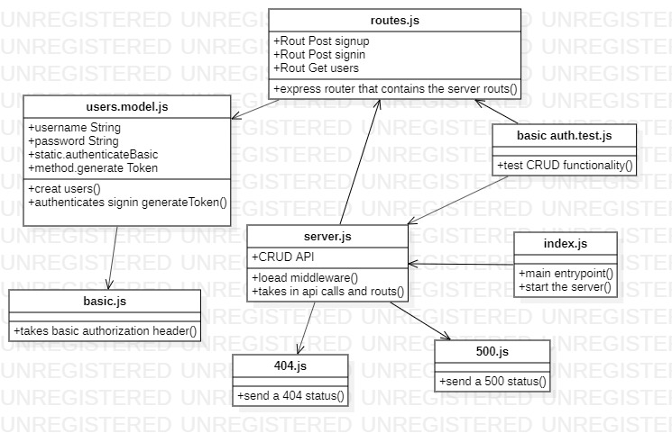
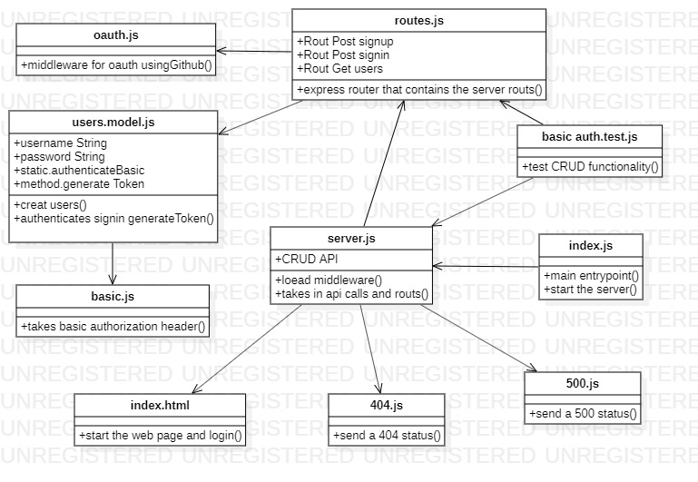

**labs**     | **URL**
------------ | -------------
Home         | [Home](https://github.com/laith-401-advanced-javascript/auth-server)
 class-11    | [class-11](https://github.com/laith-401-advanced-javascript/auth-server/pull/1)
  class-12    | [class-12](https://github.com/laith-401-advanced-javascript/auth-server/pull/2)


# class - 1

## Auth-server

An Express/Node.js based server using a custom “authentication” module that is designed to handle user registration and sign in using Basic, Bearer, or OAuth along with a custom “authorization” module that will grant/deny users access to the server based on their role or permissions level.


#### How to initialize/run your application (where applicable)

-  `node index.js`


### date
Date published

---
date: 2020-9-17 10:00
---

### author

author: Laith Al Daree
---

### location

---
location: Az Zarqa-Al Azraq-Jordan
---


### Contact 
```
---
Email:mr.laith_2011@hotmail.com
GitHub:https://github.com/laith-2020
linkedIn :https://www.linkedin.com/in/laith-aldaree/
---
```


* if you have any quastion feel free to send me an 
  email : mr.laith_2011@hotmail.com


# Action gitHub link 
[actiontest](https://github.com/laith-401-advanced-javascript/auth-server/actions/runs/264135633)


# uml

lab 1


lab 2

